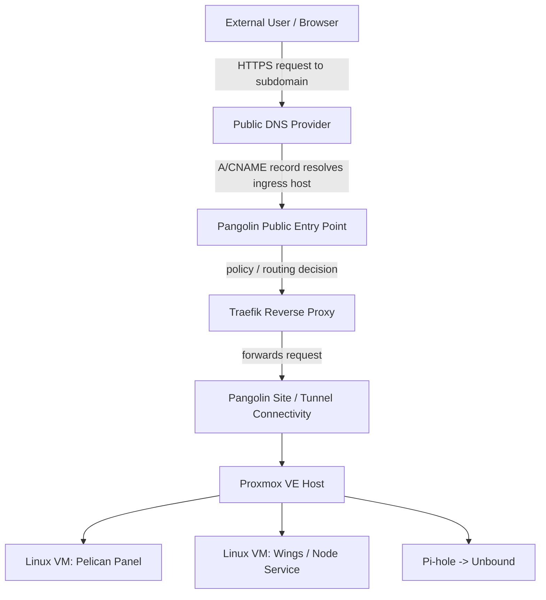

# Secure Remote Access with Pangolin and Custom Domain Routing

## Project Summary

Designed and deployed a secure remote-access layer for a self-hosted homelab environment using Pangolin, Traefik, custom DNS records, HTTPS routing, and internal service targets running on Proxmox-hosted Linux VMs.

The goal was to expose only selected services through controlled domain-based access while keeping backend services on the private LAN. The project demonstrates DNS management, reverse proxy concepts, tunnel-aware service exposure, Linux administration, Docker-based infrastructure, and real-world troubleshooting.

> Portfolio note: This document uses example hostnames and redacted internal addressing. Replace them with your real values only if you are comfortable publishing them.

---

## Environment Overview

| Layer | Implementation |
|---|---|
| Physical host | Dell PowerEdge R730XD |
| Hypervisor | Proxmox VE |
| Remote access / ingress | Pangolin |
| Reverse proxy | Traefik, managed through the Pangolin stack |
| Internal DNS | Pi-hole forwarding to Unbound |
| Game/service management | Pelican Panel + Wings |
| Service hosting | Linux VMs and Docker-based services |
| Public access pattern | Service-specific subdomains over HTTPS |

---

## Design Goals

The design focused on the following goals:

1. Expose only approved services, not the entire LAN.
2. Use service-specific subdomains instead of raw IP access.
3. Keep backend applications reachable privately on LAN IPs and ports.
4. Route external HTTPS traffic through a controlled ingress layer.
5. Reduce firewall exposure where possible.
6. Document the setup clearly enough for repeatable troubleshooting.

---

## High-Level Architecture



---

## Domain and Subdomain Pattern

The deployment used a custom domain with subdomains assigned by service role. During the build, the names changed as services were moved and corrected, so the portfolio-safe version should document by function rather than by historical hostname.

| Example hostname | Role | Backend target |
|---|---|---|
| `pang.example.com` | Pangolin dashboard / access portal | Pangolin service |
| `panel.example.com` | Pelican Panel UI | Pelican web application VM |
| `node.example.com` | Wings / node API and console target | Wings service on private LAN |
| `app.example.com` | Other self-hosted application | Internal VM or container |

The important design principle is that public users connect to HTTPS hostnames while backend services remain on private IPs and internal ports.

---

## Traffic Flow

### Public HTTPS resource flow

```text
User browser
  -> https://panel.example.com
  -> Public DNS resolves the hostname
  -> Pangolin receives the request
  -> Traefik matches the hostname/resource route
  -> Request is forwarded to the internal service target
  -> Internal service responds through the same path
```

### Internal backend example

During troubleshooting, the Wings service was confirmed to respond locally over plain HTTP on a private LAN address and port. A direct request to the backend returned the same JSON authorization-style response as the public node hostname, which confirmed that the application itself was reachable and that the remaining problem was likely proxy, TLS, domain, or WebSocket routing.

Portfolio-safe example:

```text
Internal target: http://192.168.x.x:8080
Public route:    https://node.example.com
Expected role:   Pangolin/Traefik terminates HTTPS and forwards to the HTTP backend
```


## Key Configuration Areas

### 1. DNS

Each externally reachable service requires a DNS record that points to the Pangolin ingress endpoint or upstream host. The public DNS layer should not point directly at every internal backend service.

Portfolio-safe example:

```text
pang.example.com   -> Pangolin ingress
panel.example.com  -> Pangolin ingress
node.example.com   -> Pangolin ingress
*.example.com      -> Optional wildcard record if supported and intentionally used
```

### 2. Pangolin resources

In Pangolin, each public service should be represented as a resource with a hostname and backend target. For HTTP/HTTPS applications, this allows users to access services through normal browser-based HTTPS routes.

Example resource mapping:

```text
Resource name: Pelican Panel
Public URL:    https://panel.example.com
Target:        http://192.168.x.x:80 or http://192.168.x.x:8080
Access:        Restricted to approved users or roles where applicable
```

### 3. Traefik routing

Traefik acts as the reverse proxy layer in the Pangolin stack. It receives host-based routes and forwards them to the correct service backend. This is the piece that turns multiple subdomains into clean service-specific entry points.

### 4. Internal DNS

The internal network uses Pi-hole forwarding to Unbound. That gives the environment local DNS control and recursive resolution while allowing internal service naming to remain separate from public DNS.

Example internal flow:

```text
Internal client
  -> Pi-hole
  -> Unbound
  -> Internet/root recursion or local override
```

---

## Security Considerations

Implemented or recommended controls:

- Avoid exposing backend services directly when proxy/tunnel access is available.
- Use HTTPS hostnames instead of raw IP and port access.
- Limit public resources to only the services that need external access.
- Use access rules or identity checks where available.
- Keep internal IPs, server names, and admin emails redacted in public screenshots.

